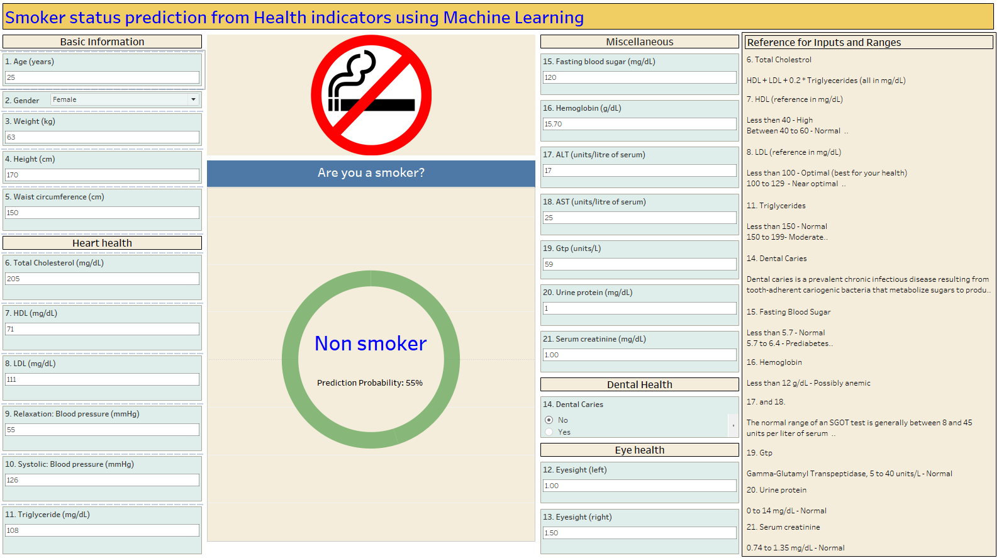

# Smoking Classification (Kaggle playground series)

This repository is a participant solution towards the Kaggle playgroun Series 3: Episode 24 competition, Binary prediction of Smoker Status using Bio-Signals. A Tableau project is developed to create a interface to accept user inputs and make dynamic predictions based on the underlying machine learning model.

## Objective

Develop a model to predict the status (Smoker or Non Smoker) based on the data of Health indicators of an individual. The ROC curve is used to evaluate the model performance.

## Data

The data for the repository is sourced from [Data 1](https://www.kaggle.com/competitions/playground-series-s3e24/data). This data is supplemented with data from another source, [Data 2](https://www.kaggle.com/datasets/gauravduttakiit/smoker-status-prediction-using-biosignals) for feature engineering purposes. 

## Analysis Summary and Results

This project uses feature engineering through domain information sourced from health websites to create a LGBM (light gradient-boosting machine) model. The Data 2 source contains `Gender` as a feature, which interestingly is closely related to the `Smoking` status. This information is used to construe a `male probability` feature in the Data 1 source. Categorical features were developed based on the health risk ranges sourced from the internet. The model built on these input features provided an appreciable 0.86 ROC metric.  

## Dashboard

A Tableau dashboard is built to dynamically accept user input. A tabpy script runs in the background to make predictions using the saved LGBM model. The generated prediction is displayed back on the Tableau dashboard along with the prediction probability. 

The dashboard contains sections to enter your data. These are highlighted in light blue. The data can be entered in the text boxes or using drop-downs where applicable. The right side contains a reference to some of the health indicators to help you while entering the related inputs. The central part of the dashboard shows the predicted results. The calculation dynamically refreshes every time a value is changed in the interface.




## Usage

The dashboard is currently not publishable with the python scripts running in the backend. Thus please follow the following if you are interested in viewing it. *Please ensure you have Tableau installed on your system.*


1. Clone [this](https://github.com/UBC-MDS/dropout-predictions.git) GitHub repository

```
git clone https://github.com/ranjitprakash1986/smoking_classification.git
```

2. Navigate to the GitHub repository

```
cd smoking_classification
```

3. Install the conda environment listed in [here](https://github.com/ranjitprakash1986/smoking_classification/blob/main/environment.yaml). This will also install `tabpy` package to your environment which is needed for running the python scripts. 

```
conda env create -f environment.yaml
```

4. Activate the environment 

```
conda activate smoking
```

5. Navigate to the folder named `dashboard` and double click the `dashboard.twb` to launch it.

```python

```
